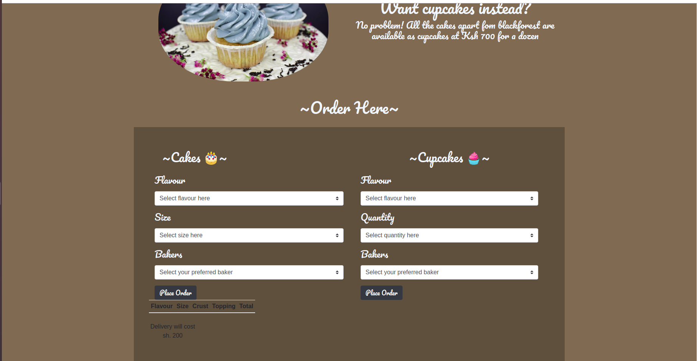

# Project name
## BakersWebsite

## Screen--shot
 

## Description
- A website that helps customers purchase cakes of their choice and it gets delivered country wide to their door step

## Author
- Ian Mwalimu
- Ongati Steve Kebaso
- Nicollette Ochola
- Catherine Nduku

## Setup instructions
- You can fork the application from github
- Open your terminal in your PC and type in the search button and search for terminal
- Double click terminal to open it. Type pwd to see the point you are in your Pc.
- Feed in the command sudo apt-get update. Then key in sudo apt BakersWebsite.
- Clone or download the project from git hub 

## BDD

 -  we have an order form where customers are able to choose the flavour of cake they want .They can also choose the size of the cake as well as the baker they want to bake their cake .

  - If the customers are interested in cupcakes they can  as well coose the quantity of cupcakes and flavour and select the baker they want to bake for them .
## Technologies Used

- [HTML & CSS](https://www.w3schools.com/html/html_css.asp) - HTML is used to make the backbone of the website which mainly includes the text whereas CSS is used in styling the HTML document.
- [Bootstrap](https://getbootstrap.com/) - Bootsrap acts as a framework in building the site especially when it comes to object positioning and responsivity of the site.
- [jQuery](https://jquery.com/) - This helps in hiding and showing elements and also in clearing forms after submission.

## License
[MIT] Copyright(BakersWebsite) 
MT:  https://rem.mit-license.org 

